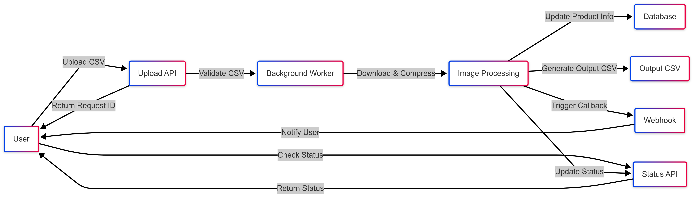

# Image Processing System

This system is designed to efficiently process image data from CSV files. It accepts a CSV file containing product information and image URLs, processes the images asynchronously, and stores the results in a database. It also generates an output CSV file with the processed image URLs.

---

## Table of Contents

1. [System Overview](#system-overview)
2. [API Documentation](#api-documentation)
3. [Database Schema](#database-schema)
4. [Asynchronous Workers](#asynchronous-workers)
5. [Setup Instructions](#setup-instructions)
6. [Testing Instructions](#testing-instructions)
7. [Error Handling](#error-handling)
8. [Future Enhancements](#future-enhancements)
9. [Contact Information](#contact-information)

---

## System Overview

### Input
- A CSV file with the following format:
```
S. No.,Product Name,Input Image Urls
1,SKU1,http://localhost:8001/cat.jpg
2,SKU2,http://localhost:8001/fox.jpg```


### Processing
- Images are downloaded from the provided URLs.
- Images are compressed to 50% of their original quality.
- Processed images are saved to a local server.

### Output
- A database entry for each product with input and output image URLs.
- An output CSV file with the following format:
```
S. No.,Product Name,Input Image Urls,Output Image Urls
1,SKU1,http://localhost:8001/cat.jpg,http://localhost:8001/processed/processed_cat.jpg
2,SKU2,http://localhost:8001/fox.jpg,http://localhost:8001/processed/processed_fox.jpg```


---

## API Documentation

### 1. Upload API
- **Endpoint**: `POST /upload/`
- **Description**: Accepts a CSV file, validates its format, and starts processing the images.
- **Request**:
- **File**: A CSV file with the required format.
- **Response**:
- **JSON**:
  ```json
  {
    "request_id": "12345"
  }
  ```

### 2. Status API
- **Endpoint**: `GET /status/{request_id}`
- **Description**: Returns the processing status for a given request ID.
- **Request**:
- **Path Parameter**: `request_id` (unique ID returned by the Upload API).
- **Response**:
- **JSON**:
  ```json
  {
    "request_id": "12345",
    "status": "Completed",
    "output_csv_path": "outputs/output_12345.csv"
  }
  ```

### 3. Webhook
- **Endpoint**: `POST /webhook/`
- **Description**: Handles callbacks after processing is complete.
- **Request**:
- **JSON**:
  ```json
  {
    "request_id": "12345",
    "status": "Completed"
  }
  ```
- **Response**:
- **JSON**:
  ```json
  {
    "status": "Webhook received"
  }
  ```

---

## Database Schema

The system uses a SQLite database to store product information and processing status. The schema is as follows:

### Table: `products`
| Column Name       | Data Type | Description                          |
|-------------------|-----------|--------------------------------------|
| `id`              | Integer   | Primary key, auto-incremented.       |
| `serial_number`   | Integer   | Unique identifier for the product.   |
| `product_name`    | String    | Name of the product.                 |
| `input_image_urls`| String    | Comma-separated input image URLs.    |
| `output_image_urls`| String   | Comma-separated output image URLs.   |
| `processed`       | Boolean   | Indicates if processing is complete. |

---

## Asynchronous Workers

The system uses **background tasks** to process images asynchronously. Here’s how it works:

1. **Upload API**:
 - Accepts the CSV file and starts a background task to process the images.
 - Returns a unique `request_id` immediately.

2. **Background Task**:
 - Downloads images from the provided URLs.
 - Compresses images to 50% of their original quality.
 - Saves processed images to the local server.
 - Updates the database with input and output image URLs.
 - Generates an output CSV file.

3. **Status API**:
 - Allows users to check the status of the background task using the `request_id`.

---

## Setup Instructions

1. **Clone the Repository**:
   git clone https://github.com/dev-7devil7/Image-Processing-Syster.git
   cd image-processing-system

2. **Set Up the Virtual Environment**:
   python -m venv venv
   source venv/bin/activate  
   venv\Scripts\activate  -- [On Windows] 

3. **Install Dependencies**:
   pip install -r requirements.txt

4. **Run the Application:**:
   uvicorn main:app --reload

5. **Start the Local Image Server**:
   python -m http.server 8001 --directory images

6. **Test the APIs**:
    Use the provided Postman collection or Swagger UI (http://localhost:8000/docs).


## Testing Instructions

1. **Prepare a CSV File**:
   - Create a CSV file with the required format (see **Input** section).

2. **Upload the CSV File**:
   - Use the `/upload/` endpoint to upload the CSV file.

3. **Check the Status**:
   - Use the `/status/{request_id}` endpoint to check the processing status.

4. **Verify the Output**:
   - Check the `outputs/` folder for the generated CSV file.
   - Check the `images/processed/` folder for the processed images.

---

## Error Handling

The system handles the following errors gracefully:
- Invalid CSV format.
- Failed image downloads.
- Failed image processing.
- Database connection issues.

---

## Future Enhancements

1. **Support for Multiple Image Formats**:
   - Extend the system to handle formats like PNG, GIF, etc.

2. **Cloud Storage Integration**:
   - Save processed images to cloud storage (e.g., AWS S3, Google Cloud Storage).

3. **Enhanced Error Reporting**:
   - Provide detailed error messages for debugging.

4. **Scalability Improvements**:
   - Use a message queue (e.g., RabbitMQ, Kafka) for better scalability.


## Workflow Diagram

Below is the workflow diagram for the image processing system:




# Workflow Diagram Description

## Components

1. **User**: Initiates the process by uploading a CSV file.
2. **Upload API**: Accepts the CSV file and validates its format.
3. **Background Worker**: Processes images asynchronously.
4. **Image Processing Service**: Downloads, compresses, and saves images.
5. **Database**: Stores product information and processing status.
6. **Output CSV Generator**: Creates an output CSV file with processed image URLs.
7. **Webhook**: Sends a callback after processing is complete.
8. **Status API**: Allows users to check the processing status.

---

## Workflow Steps

### 1. User Uploads CSV
- The user uploads a CSV file via the **Upload API**.
- The API validates the CSV format and returns a `request_id`.

### 2. Background Worker Starts
- The system starts a background task to process the images.

### 3. Image Processing
- The **Image Processing Service**:
  - Downloads images from the URLs in the CSV.
  - Compresses images to 50% of their original quality.
  - Saves processed images to the local server.

### 4. Database Update
- The system updates the database with:
  - Product information.
  - Input and output image URLs.
  - Processing status.

### 5. Output CSV Generation
- The system generates an output CSV file with:
  - Original product information.
  - Processed image URLs.

### 6. Webhook Trigger
- After processing is complete, the system triggers a webhook to notify the user.

### 7. Status Check
- The user can check the processing status using the **Status API** and the `request_id`.

---